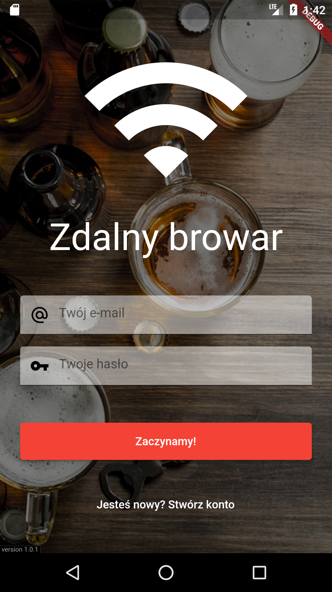
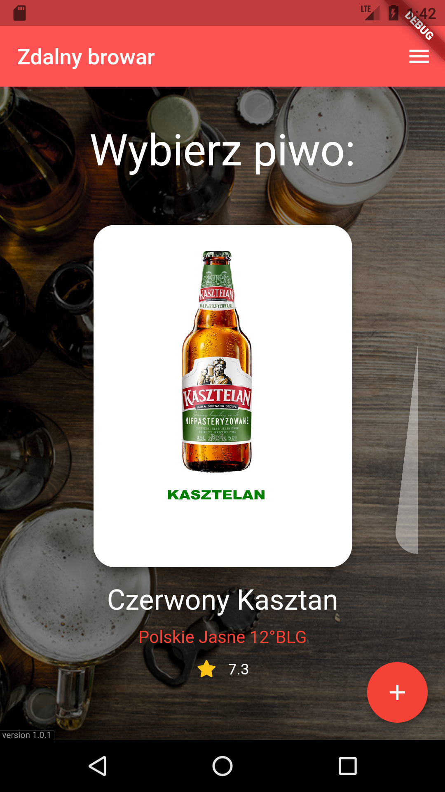
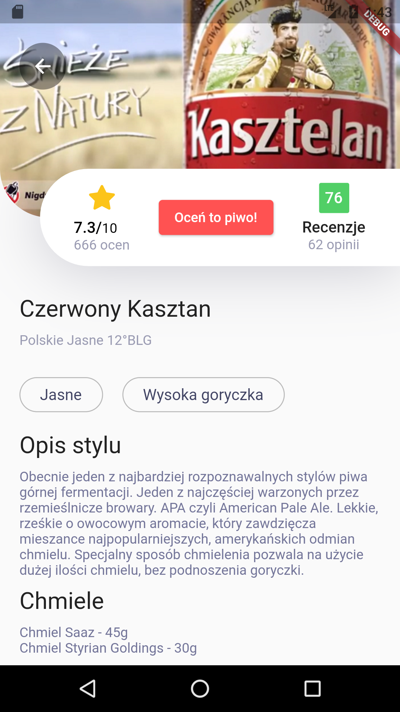

# brewery-app - Zdalny browar
Flutter mobile application.

## installation/run
- copy .env.dist to .env
- generate `android/app/google-services.json` from firebase

## web version:
- flutter doctor
- flutter devices
- export CHROME_EXECUTABLE=/snap/bin/chromium
- flutter run -d chrome

## Screenshots:

## link referencyjny:
- np https://zdalny-browar.kazmierski.com.pl/?code=abc

## TODO
- możliwość edycji oceny,
- jak już oceniłeś piwo to przycisk powinien być: piwo już oceniłeś
- naprawić loader jak dodajemy ocenę, jeste teraz biały screen
- liczba ocen piwa
- PressDoubleBackToClose dodać nawigacje, czyli przy rejestracji można cofnąć do logowania
- resetowanie hasła zrobić
- zrobić menu -> Ustawienia
- tłumaczenie na EN
- HomeBloc: cache na beers aby loader wciąż nie chodził tylko odświeżało się w tle

## Release AAB file
- change version: 1.0.1+3 for new version and new code: version: 1.0.2+4
- flutter build appbundle --release -> file AAB in build/app/outputs/bundle/release/
